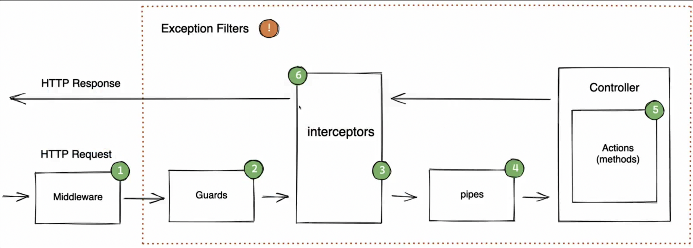

# NestJS Lifecycle



1. Guards：保护路由的组件，用于权限验证和访问控制，在请求到达控制器之前进行身份验证和授权检查
   ```ts
   @Injectable()
   export class AuthGuard implements CanActivate {
     canActivate(context: ExecutionContext): boolean {
       const request = context.switchToHttp().getRequest();
       return this.validateRequest(request);
     }
   }
   ```
2. Interceptors: 用于拦截请求和响应的组件，可以在请求处理前后添加额外的逻辑，如日志记录、数据转换等
   ```ts
   @Injectable()
   export class LoggingInterceptor implements NestInterceptor {
     intercept(context: ExecutionContext, next: CallHandler): Observable<any> {
       console.log('Before...');
       return next.handle().pipe(tap(() => console.log('After...')));
     }
   }
   ```
3. Pipes: 用于数据转换和验证的组件，对输入数据进行验证、转换和清理
   ```ts
   @Injectable()
   export class ValidationPipe implements PipeTransform {
     transform(value: any, metadata: ArgumentMetadata) {
       if (!value) {
         throw new BadRequestException('Value is required');
       }
       return value;
     }
   }
   ```
4. Controllers: 处理 HTTP 请求的组件，接收请求、调用服务层处理业务逻辑、返回响应
   ```ts
   @Controller('users')
   export class UsersController {
     @Get()
     findAll() {
       return [];
   ```
5. Exception Filters: 用于处理异常的组件，捕获和处理应用程序中抛出的异常

   ```ts
   @Catch(HttpException)
   export class HttpExceptionFilter implements ExceptionFilter {
     catch(exception: HttpException, host: ArgumentsHost) {
       const ctx = host.switchToHttp();
       const response = ctx.getResponse();
       const status = exception.getStatus();

       response.status(status).json({
         statusCode: status,
         message: exception.message,
       });
     }
   }
   ```

6. Middleware: 不常用，用于处理请求和响应的中间件，可以在请求处理前后添加额外的逻辑，如日志记录、数据转换等
   创建中间件的命令：`nest g middleware common/logger`
